### 方法论

https://gitissue.com/issues/5b44f7bb9906f66a9d9b23fe

https://zhuanlan.zhihu.com/p/36996225

### San - 一个传统的MVVM组件框架

https://efe.baidu.com/blog/san-a-traditional-mvvm-component-framework/

的目标，提供 CDN、支持 AMD 和 Global Object、npm publish 也都是很简单的事情，更难抉择的是 “你们怎么解决兼容性问题”。

**通过方法操作组件数据，解决兼容性**

+ 用最简单的形式，解决兼容性问题
+ San 的开发体验不可能做的比 Vue 更好
+ 数据操作的过程可控。实际上，从 3.1.0 开始，数据变更在内部是 Immutable 的
+ change tracking好做了。我们并不认为 v-dom 是万金油，并且 San 是面向 Web 设计的，我们并没期望它跨平台。所以少掉 v-dom 这一层是一件好事

但是，把数据封起来意味着获取数据成本也变高了，特别是想一次获取多个数据的时候。所以我们把获取数据的 get 方法实现为，无参的时候返回整个数据对象，如果你用 ESNext 开发可以方便的使用解构。但是，操作数据还是要通过 `set` 或 `splice` 等方法的。

**10K**

+ 其实这也不是什么很有技术含量的事情，为此我们直接手写 ES5 代码而不是 ESNext + Babel，在很多人看来还是挺 low B 的。具体是不是 10k 也没什么意义，只是态度而已。我们希望 San 的使用者不会受到体积的困扰，我们也希望体积强迫症患者能有更多的选择。

### San 为什么会这么快

# 视图创建

考虑下面这个还算简单的组件：

```js
const MyApp = san.defineComponent({
    template: `
        <div>
            <h3>{{title}}</h3>
            <ul>
                <li s-for="item,i in list">{{item}} <a on-click="removeItem(i)">x</a></li>
            </ul>
            <h4>Operation</h4>
            <div>
                Name:
                <input type="text" value="{=value=}">
                <button on-click="addItem">add</button>
            </div>
            <div>
                <button on-click="reset">reset</button>
            </div>
        </div>
    `,

    initData() {
        return {
            title: 'List',
            list: []
        };
    },

    addItem() {
        this.data.push('list', this.data.get('value'));
        this.data.set('value', '');
    },

    removeItem(index) {
        this.data.removeAt('list', index);
    },

    reset() {
        this.data.set('list', []);
    }
});
```

在视图初次渲染完成后，[San](https://github.com/baidu/san/) 会生成一棵这样子的树：


那么，在这个过程里，[San](https://github.com/baidu/san/) 都做了哪些事情呢？

# 模板解析

## 概述

在组件第一个实例被创建时，**template** 属性会被解析成 [ANode](https://github.com/baidu/san/blob/master/doc/anode.md)。

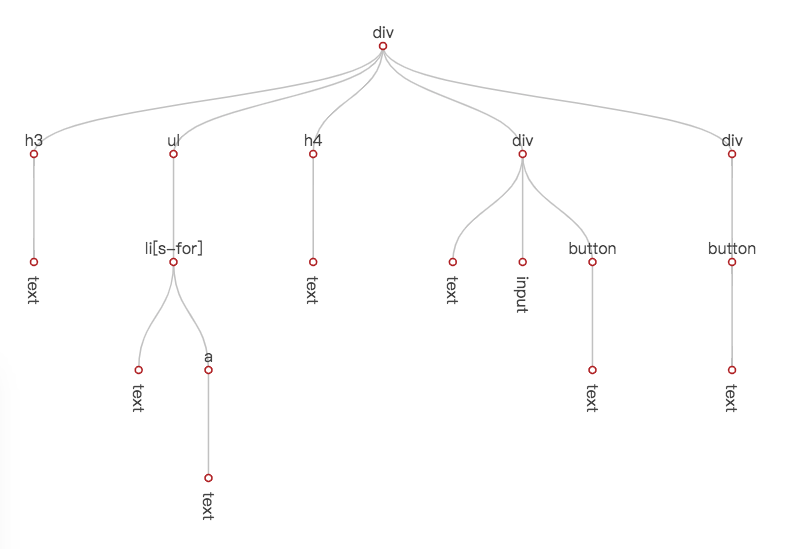

[ANode](https://github.com/baidu/san/blob/master/doc/anode.md) 的含义是抽象节点树，包含了模板声明的所有信息，包括标签、文本、插值、数据绑定、条件、循环、事件等信息。对每个数据引用的声明，也会解析出具体的表达式对象。

```js
// "tagName": "ul"
{
    "directives": {},
    "props": [],
    "events": [],
    "children": [
        {
            "directives": {
                "for": {
                    "item": "item",
                    "value": {
                        "type": 4,
                        "paths": [
                            {
                                "type": 1,
                                "value": "list"
                            }
                        ]
                    },
                    "index": "i",
                    "raw": "item,i in list"
                }
            },
            "props": [],
            "events": [],
            "children": [
                {
                    "textExpr": {
                        "type": 7,
                        "segs": [
                            {
                                "type": 5,
                                "expr": {
                                    "type": 4,
                                    "paths": [
                                        {
                                            "type": 1,
                                            "value": "item"
                                        }
                                    ]
                                },
                                "filters": [],
                                "raw": "item"
                            }
                        ]
                    }
                },
                {
                    "directives": {},
                    "props": [],
                    "events": [
                        {
                            "name": "click",
                            "modifier": {},
                            "expr": {
                                "type": 6,
                                "name": {
                                    "type": 4,
                                    "paths": [
                                        {
                                            "type": 1,
                                            "value": "removeItem"
                                        }
                                    ]
                                },
                                "args": [
                                    {
                                        "type": 4,
                                        "paths": [
                                            {
                                                "type": 1,
                                                "value": "i"
                                            }
                                        ]
                                    }
                                ],
                                "raw": "removeItem(i)"
                            }
                        }
                    ],
                    "children": [
                        {
                            "textExpr": {
                                "type": 7,
                                "segs": [
                                    {
                                        "type": 1,
                                        "literal": "x",
                                        "value": "x"
                                    }
                                ],
                                "value": "x"
                            }
                        }
                    ],
                    "tagName": "a"
                }
            ],
            "tagName": "li"
        }
    ],
    "tagName": "ul"
}
```

[ANode](https://github.com/baidu/san/blob/master/doc/anode.md) 保存着视图声明的数据引用与事件绑定信息，在视图的初次渲染与后续的视图更新中，都扮演着不可或缺的作用。

无论一个组件被创建了多少个实例，**template** 的解析都只会进行一次。当然，预编译是可以做的。但因为 **template** 是用才解析，没有被使用的组件不会解析，所以就看实际使用中值不值，有没有必要了。

## pending

模板解析的主要代码位于：[src/parser/parse-template](https://github.com/baidu/san/blob/master/src/parser/parse-template.js)

深度优先，通过while循环实现

svgTags

数据环境是如何约束的？如何做到约束item和i

`li> {{item}} \<a on-click="removeItem(i)">x\</a>`

## API

### **匹配标签的正则**

```js
// 用于匹配html标签，包括开标签和闭标签，标签允许用-连接，允许接空格
// 第一个捕获组是 / 
// 第二个捕获组是 标签名，标签必须以字母开头，忽略大小写
var tagReg = /<(\/)?([a-z][a-z0-9-]*)\s*/ig;
```

`\s*`会匹配标签名之后 到`>`或者`attr`之间的空格

通过捕获组判断是否是闭标签

通过捕获组获取标签名

### 匹配属性的正则

```js
// 用于匹配属性的正则 
// 第一个捕获组 =之前的内容
// 第二个捕获组 =及之后的内容，反向引用了第三个捕获组，进行引号匹配
// 第三个捕获组 引号
// 第四个捕获组 =之后的内容，反向引用了第三个捕获组，提高匹配效率
var attrReg = /([-:0-9a-z\[\]_]+)(\s*=\s*(['"])([^\3]*?)\3)?\s*/ig;
```


### **walker类**

包含一系列文本操作的方法，用index属性标记处理位置，逐个处理

根据lastIndex的定义，lastIndex代表着下一次匹配开始的索引位置

因此有 `nextCharCode = walker.currentCode()`

### pushTextNode(text)

```js
pushTextNode(source.slice(beforeLastIndex, tagMatchStart));
```

因为每次`tagMatch`都只能匹配标签，因此`beforeLastIndex`和`tagMatchStart`可以截取**相邻标签的纯文本**。包括：

+ 父开标签和子开标签之前的内容 `li>{{item}}<a`
+ 开标签和闭标签之前的内容`h3>{{title}}</h3`

在读取栈中添加文本节点

```js
if (text) {
    currentNode.children.push({
      	textExpr: parseText(text, options.delimiters)
    });
}
```

### parseText()

动态构建正则，读取插值

默认正则：`/\{\{\s*([\s\S]+?)\s*\}\}/g`，匹配双花括号内的全部内容

### parseInterp()

解析插值替换

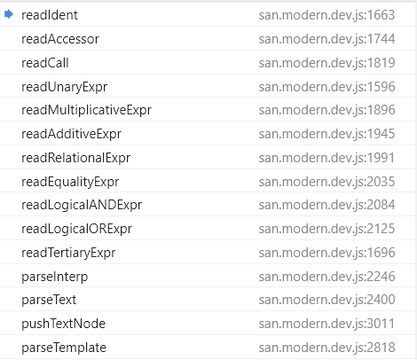

## 循环解析template

### **根标签div**

从`walker.index:0`开始解析

```js
tagMatch = walker.match(tagReg)
// tagMatch: <div (undefined) (div) index=0 
// walker.index = reg.lastIndex = 4
```

**是**开标签

1. 根据标签名判定**不是**自闭合标签
   
2. while循环读取属性

   1. `nextCharCode`为62 `>`，开标签结束，`walker.go(1)`，break

3. pushTextNode('')

4. **不是**if/else指令

   1. **不是**table标签

   2. ```js
      currentNode.children.push(aElement);
      // rootNode.children --- divNode
      ```

5. ```js
   if (!tagClose) {
     currentNode = aElement; 
     stack[++stackIndex] = aElement;
   }
   ```

`beforeLastIndex = walker.index; // 5`

### **div>h3**

从`walker.index:5`开始解析

```js
// tagMatch: <h3 (undefined) (h3) index=5
// walker.index = reg.lastIndex = 8
```

**是**开标签

1. **不是**自闭合标签

2. while循环读取属性，`walker.go(1)`，break

3. pushTextNode('')

4. **不是**if/else指令

   1. **不是**table标签

   2. ```js
      currentNode.children.push(aElement);
      // divNode.children --- h3Node
      ```

5. 同上

`beforeLastIndex = walker.index; // 9`

### \<h3>{{title}}\</h3>

从`walker.index:9`开始解析

```js
// tagMatch: </h3 (/) (h3) index=18
// walker.index = reg.lastIndex = 22
```

**是**闭标签

1. `walker.currentCode===62`，关闭标签，向上查找到对应标签，找不到时忽略关闭

2. `stack[stackIndex].tagName === tagName`

3. ```js
   pushTextNode(source.slice(beforeLastIndex, tagMatchStart));
   // pushTextNode(source.slice(9, 18));
   // pushTextNode('{{text}}')
   // currentNode
   {
     "directives":{},
     "props":[],
     "events":[],
     "children":[{
       "textExpr":{
         "type":7,
         "segs":[{
           "type":5,
           "expr":{
             "type":4,
             "paths":[{
               "type":1,
               "value":"title"
             }]
           },
           "filters":[],
           "raw":"title"
         }]
       }
     }],
     "tagName":"h3"}
   ```

4. ```js
   // 关闭标签
   if (closeIndex > 0) {
     stackIndex = closeIndex - 1;
     currentNode = stack[stackIndex]; // currentNode === divNode
   }
   walker.go(1); // 23
   ```

### ul>li

`ul`从`walker.index:23`开始解析，解析过程与根标签类似，解析结束时`walker.index:27`

`li`从`walker.index:23`开始解析

**是**开标签

1. 不是自闭合标签

2. while循环读取属性

   1. `var attrMatch = walker.match(attrReg);`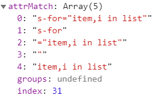

   2. `integrateAttr(aNode,"s-for'","item,i in list")`

      `parseDirective(aNode,"for","item,i in list")`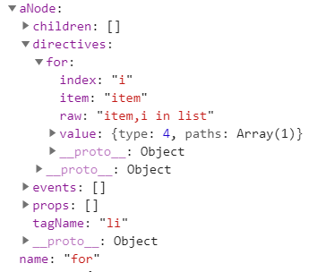

   3. `nextCharCode`为62 `>`，开标签结束，`walker.go(1)`，break

3. 剩余同div

### li> {{item}} \<a on-click="removeItem(i)">x\</a>

从`walker.index:54`开始解析

```js
// tagMatch: <a (undefined) (a) index=63
// walker.index = reg.lastIndex = 66
```

是开标签

1. 不是自闭合标签

2. while循环读取属性

   1. `var attrMatch = walker.match(attrReg);`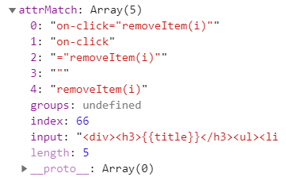
   2. `integrateAttr(aNode,"on-click'","removeItem(i)")`

3. `pushTextNode(source.slice(beforeLastIndex, tagMatchStart));`

   `pushTextNode(source.slice(54,63));`

   `pushTextNode('{{item}}');`

4. 同`{{title}}`

## 引用API

### ExprType

表达式类型

```js
var ExprType = {
    STRING: 1,
    NUMBER: 2,
    BOOL: 3,
    ACCESSOR: 4,  // 表达式对象, create-accessor()
    INTERP: 5, // 插值替换
    CALL: 6, // 函数调用
    TEXT: 7,
    BINARY: 8, // 二元表达式，包括
    UNARY: 9, // 一元表达式
    TERTIARY: 10, // 三元表达式
    OBJECT: 11,
    ARRAY: 12,
    NULL: 13
};
```

# preheat

## 概述

在组件第一个实例被创建时，[ANode](https://github.com/baidu/san/blob/master/doc/anode.md) 会进行一个 **预热** 操作。看起来， **预热** 和 **template解析** 都是发生在第一个实例创建时，那他们有什么区别呢？

1. **template解析** 生成的 [ANode](https://github.com/baidu/san/blob/master/doc/anode.md) 是一个可以被 JSON stringify 的对象。
2. 由于 1，所以 [ANode](https://github.com/baidu/san/blob/master/doc/anode.md) 可以进行预编译。这种情况下，**template解析** 过程会被省略。而 **预热** 是必然会发生的。

接下来，让我们看看预热到底生成了什么？

```js
aNode.hotspot = {
    data: {}, // recordHotspotData()   	
    dynamicProps: [],
    xProps: [],
    props: {},
    sourceNode: sourceNode,
  	// binds? binds仅在处理 aNode.props的时候有
};
```

上面这个来自 [preheat-a-node.js](https://github.com/baidu/san/blob/15935bdaad42246742e16759f789af536592c3b7/src/view/preheat-a-node.js) 的简单代码节选不包含细节，但是可以看出， **预热** 过程生成了一个 `hotspot` 对象，其包含这样的一些属性：

- data - 节点数据引用的摘要信息
- dynamicProps - 节点上的动态属性
- xProps - 节点上的双向绑定属性
- props - 节点的属性索引
- sourceNode - 用于节点生成的 HTMLElement

**预热** 的主要目的非常简单，就是把在模板信息中就能确定的事情提前，只做一遍，避免在 **渲染/更新** 过程中重复去做，从而节省时间。**预热** 过程更多的细节见 [preheat-a-node.js](https://github.com/baidu/san/blob/15935bdaad42246742e16759f789af536592c3b7/src/view/preheat-a-node.js)。在接下来的部分，对 `hotspot` 发挥作用的地方也会进行详细说明。

```json
this.source = typeof options.source === 'string'
    ? parseTemplate(options.source).children[0]
    : options.source;
preheatANode(this.source);
```

## pending

深度优先，通过递归实现

究竟什么是可以确定的？为什么？

data - 节点数据引用的摘要信息 是在哪里生成/确定的呢？# data start #data end

根标签div在模板解析的过程中添加了`calss style id`三个属性，明明模板上是没有的，猜测是用于默认类名？

哪些是动态的？哪些不是？

> `prop.expr.value == null`
>
> 1. 是双向绑定的属性
>    1. 要push到`hotstop.xProps`
> 2. `aNode.hotspot.dynamicProps.push(prop);`

@@@ 同样意义不明，ClaZZ属性丢失了吗？没有 stack里面还保存着，但是这个新的 aNode 有什么用呢？

静态属性是在哪里设置的呢？h3 之下的 title属于插值，所以没有被提前设置，为什么呢？

```js
else if (prop.expr.value != null) {
  if (sourceNode) {
    prop.handler(sourceNode, prop.expr.value, prop.name, aNode);
  }
}
```

isDynamic为什么没起作用 @@@

因为`accessorMeanDynamic`影响的是下一层的`isDynamic`，暂时没有遇到这样的案例

## API

### preheat

主要逻辑全在这个函数里面，只要`ANode!==null`

**analyseANodeHotspot()**

遍历aNode所有的属性数组，调用**recordHotspotData()**进行记录

分析完自身的属性之后，会遍历子孙调用**analyseANodeHotspot()**

**recordHotspotData()**

被前者调用，调用**analyseExprDataHotspot**，生成数据引用摘要

生成的摘要是有规律的，取决于 `expr.type`的顺序

为什么会把子元素的引用摘要也添加到父元素上呢？会合s-for 的数据环境有关吗 item i 

### analyseExprDataHotspot

是一个递归函数，分析好数据会被记录

switch不同的expr.type，做不同的处理

主要作用是生成data摘要？同时判断是否是动态的

**analyseExprs()**

遍历表达式数组，递归调用**analyseExprDataHotspot**

返回值会并入refs

同时判断是否是动态的，动态的肯定是不能提前确定的

## 预热

### 根标签div

在模板解析的过程中添加了`calss style id`三个属性，明明模板上是没有的

`preheatANode(aNode)`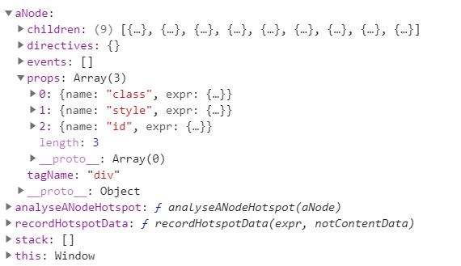

1. `analyseANodeHotspot(aNode);`
   1. `aNode.textExpr`为`undefined`，
   2. 根据 `tagName` 创建 `sourceNode`。
   3. 初始化`hotspot`属性
   4. 分析 `hotstop data`，节点数据引用的摘要信息
      1. `aNode.vars`，undefined
      2. `aNode.props`
         1. 在`aNode.hotspot.binds`记录`prop.expr`
         2. `recordHotspotData(prop.expr)`，`name`为`class`
            1. `analyseExprDataHotspot(expr)`
               1. `expr.type`为7
               2. `analyseExprs(expr.segments)`
                  1. 遍历调用`analyseExprDataHotspot(expr[i])`
                     1. `expr.type`为5
                     2. `analyseExprDataHotspot(expr.expr)`
                        1. `expr.type`为4
                        2. 直接获取访问表达式的路径，`value`为`class`
                        3. `analyseExprs(paths.slice(1),1)`，undefined,**是动态的**
                        4. `refs=['class']`
                     3. 处理过滤器
                        1. `analyseExprs(filter.name.paths);`
                           1. 遍历调用父函数，type为1，string，没有做任何处理
                        2. `analyseExprs(filter.args:null);`
                     4. 返回`refs=['class']`
                  2. 返回`refs`
               3. 返回`refs`
            2. `data[ref] = 1;`
         3. `recordHotspotData(prop.expr)`，`name`为`style`
            1. expr.type依次为 7 5 4，`refs=['style']`
         4. `recordHotspotData(prop.expr)`，`name`为`id`
            1. expr.type依次为 4 1 ，`refs=['id']`
      3. `aNode.directives`
      4. `aNode.elses`
      5. `aNode.children`
         1. 遍历 递归调用`analyseANodeHotspot`
2. 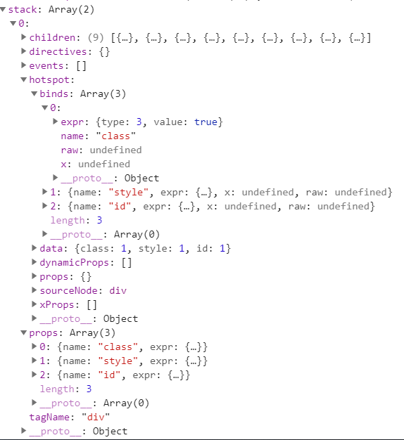

### div>h3

作为根标签div的第一个子元素，`analyseANodeHotspot(h3Node);`

1. `aNode.textExpr`为`undefined`，
2. 根据 `tagName` 创建 `sourceNode`,h3
3. 初始化`hotspot`属性
4. 分析 `hotstop data`，节点数据引用的摘要信息
   1. `aNode.vars`，undefined
   2. `aNode.props`，[]
   3. `aNode.directives`，[]
   4. `aNode.elses`，[]
   5. `aNode.children`，遍历 递归调用`analyseANodeHotspot`

### \<h3>{{title}}\</h3>

作为h3的第一个子元素，`analyseANodeHotspot(titleANode);`

1. `aNode.textExpr`有值
2. 初始化`hotspot`属性为**空对象** `aNode.hotspot = {};`
3. 设置类型为TextNode，`aNode.Clazz = TextNode;`
4. `recordHotspotData(aNode.textExpr);`
   1. `expr.type`为 7 5 4 ，`refs=['title']`
   2. 遍历了`stack`所有的`data`，因此包括父元素的data，包括`h3.hotstop.data`和`div.hotstop.data`
   3. 给父元素和自身添加了：`data[title] = 1;`

### ul>li

ul的预热过程与h3类似，因为相关的属性都没有值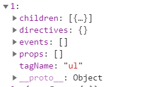

li作为ul的第一个子元素在ul的预热阶段expr.children被传入`analyseANodeHotspot(liNode)`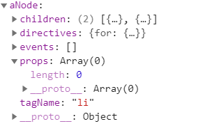

1. 需要预热的仅有`directives`
2. `recordHotspotData(aNode.directives['for'].value)`
   1. `expr.type`依次是 4 1 ，返回 `refs=['list']`
   2. 栈内的节点`hotstop.data`增加`list`字段，即 `divNode ulNode liNode`
3. 没有`trackBy`标记
4. `expr.children()`

### li> {{item}} \<a>...\</a>

{{item}}作为li的第一个子元素，在li的预热阶段expr.children被传入`analyseANodeHotspot()`

1. aNode.textExpr
2. Expr.type依次为7 5 4 1， 返回 `refs = [item] `

a标签作为li的第二个子元素，被传入`analyseANodeHotspot()`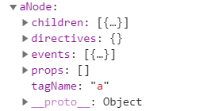

1. aNode.events有值，但是预热阶段不会处理
2. aNode.children

### \<a on-click="removeItem(i)">x\</a>

a标签只有一个子元素，即纯文本x，textExpr有值，expr.type依次为 7 1，`refs=[]`

### li

**子孙遍历完成之后，继续处理for指令**

```js
if (aNode.directives['for']) { // eslint-disable-line dot-notation
  aNode.forRinsed = {
    children: aNode.children,
    props: aNode.props,
    events: aNode.events,
    tagName: aNode.tagName,
    vars: aNode.vars,
    hotspot: aNode.hotspot,
    directives: extend({}, aNode.directives)
  };
  aNode.hotspot.hasRootNode = true;
  aNode.Clazz = ForNode;
  aNode.forRinsed.directives['for'] = null; // @@@ eslint-disable-line dot-notation
  aNode = aNode.forRinsed; // @@@ 同样意义不明，ClaZZ属性丢失了吗？没有 stack里面还保存着，但是这个新的 aNode 有什么用呢？
}
```

### \<input type="text" value="{=value=}">

input类型不会创建`sourceNode`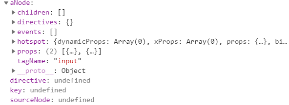

需要预热的只有props，其中一个是双向绑定

> 感觉div会有类似的处理，但是没什么没有注意到呢？因为需要子孙全部递归完之后，才会处理div的props

1. 分析 `hotstop data`
   1. `inputNode.props`
      1. 在`inputNode.hotspot.binds`记录`prop.expr`
         1. `expr.raw`有值，引用原值
      2. `recordHotspotData(prop.expr)`，`name`为`type`
         1. `expr.type`为1，返回 `refs=[]`
      3. `recordHotspotData(prop.expr)`，`name`为`value`
         1. `expr.type`依次为 4 1，返回 `refs=['value']`
         2. stack记录摘要
2. 分析 `hotstop props`，name为type
   1. `aNode.hotspot.props[prop.name] = index;`
   2. `prop.handler = getPropHandler(aNode.tagName, prop.name);`
      1. 不是svg相关标签名
      2. `tagPropHandlers = elementPropHandlers[tagName];`
         1. 赋值了预设好的处理函数
      3. `propHandler = tagPropHandlers[attrName];`
         1. undefined，不是预设的几个属性之一
         2. 获取默认的属性处理函数
      4. 返回`propHandler`
   3. `prop.expr.value != null`
      1. 没有sourceNode
3. 分析 `hotstop props`，name为value
   1. 与type类似
   2. `prop.expr.value == null`
      1. 是双向绑定的属性
         1. 要push到`hotstop.xProps`
      2. `aNode.hotspot.dynamicProps.push(prop);`

### 预热阶段设置静态属性

使用以下模板进行测试

```js
template: `<div><a name='title'></a></div>`
```

需要预热的只有静态属性`name`

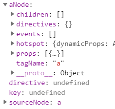 

在`div`的`expr.children`被传入`analyseANodeHotspot`

1. 分析 `hotstop data`
   1. `expr.props`
      1. 在`atNode.hotspot.binds`记录`prop.expr`
         1. `expr.raw`有值`title`，引用原值
      2. `recordHotspotData(prop.expr)`
         1. `expr.type`为 1 ，返回 `refs=[]` 

2. 分析`hotstop props`

   1. 设置index

   2. 获取属性的handler

      1. a标签没有预设的`tagHandler`，设置为空对象
      2. `propHandler`自然也为空，没有`name`属性的预设`propHandler`，因此获取默认handler

   3. `prop.expr.value != null`

      1. 存在`sourceNode`

         1. `prop.handler(sourceNode, prop.expr.value, prop.name, aNode);`

            1. 设置属性名为`name`

            2. 属性值不为空

            3. 在预热阶段就设置了静态属性 @@@

               ```js
               if (propName in el) {
                 el[propName] = valueNotNull ? value : '';
               }
               else if (valueNotNull) {
                 el.setAttribute(name, value);
               }
               
               if (!valueNotNull) {
                 el.removeAttribute(name);
               }
               ```


# 视图创建过程


视图创建是个很常规的过程：基于初始的 **数据** 和 [ANode](https://github.com/baidu/san/blob/master/doc/anode.md)，创建一棵对象树，树中的每个节点负责自身在 DOM 树上节点的操作（创建、更新、删除）行为。对一个组件框架来说，创建对象树的操作无法省略，所以这个过程一定比原始地 createElement + appendChild 慢。

因为这个过程比较常规，所以接下来不会描述整个过程，而是提一些有价值的优化点。

#### cloneNode

在 **预热** 阶段，我们根据 `tagName` 创建了 `sourceNode`。

```js
if (isBrowser && aNode.tagName
    && !/^(template|slot|select|input|option|button)$/i.test(aNode.tagName)
) {
    sourceNode = createEl(aNode.tagName);
}
```

[ANode](https://github.com/baidu/san/blob/master/doc/anode.md) 中包含了所有的属性声明，我们知道哪些属性是动态的，哪些属性是静态的。对于静态属性，我们可以在 **预热** 阶段就直接设置好。See [preheat-a-node.js](https://github.com/baidu/san/blob/15935bdaad42246742e16759f789af536592c3b7/src/view/preheat-a-node.js#L122-L142)

```js
each(aNode.props, function (prop, index) {
    aNode.hotspot.props[prop.name] = index;
    prop.handler = getPropHandler(aNode.tagName, prop.name);

    // ......
    if (prop.expr.value != null) {
        if (sourceNode) {
            prop.handler(sourceNode, prop.expr.value, prop.name, aNode);
        }
    }
    else {
        if (prop.x) {
            aNode.hotspot.xProps.push(prop);
        }
        aNode.hotspot.dynamicProps.push(prop);
    }
});
```

在 **视图创建过程** 中，就可以从 `sourceNode` clone，并且只对动态属性进行设置。See [element.js#L115-L150](https://github.com/baidu/san/blob/15935bdaad42246742e16759f789af536592c3b7/src/view/element.js#L115-L150)

```js
var sourceNode = this.aNode.hotspot.sourceNode;
var props = this.aNode.props;

if (sourceNode) {
    this.el = sourceNode.cloneNode(false);
    props = this.aNode.hotspot.dynamicProps;
}
else {
    this.el = createEl(this.tagName);
}

// ...

for (var i = 0, l = props.length; i < l; i++) {
    var prop = props[i];
    var propName = prop.name;
    var value = isComponent
        ? evalExpr(prop.expr, this.data, this)
        : evalExpr(prop.expr, this.scope, this.owner);

    // ...

    prop.handler(this.el, value, propName, this, prop);
    
    // ...
}
```

#### 属性操作

不同属性对应 DOM 的操作方式是不同的，属性的 **预热** 提前保存了属性操作函数（[preheat-a-node.js#L133](https://github.com/baidu/san/blob/15935bdaad42246742e16759f789af536592c3b7/src/view/preheat-a-node.js#L133)），属性初始化或更新时就无需每次都重复获取。

```js
prop.handler = getPropHandler(aNode.tagName, prop.name);
```

对于 `s-bind`，对应的数据是 **预热** 阶段无法预知的，所以属性操作函数只能在具体操作时决定。See [element.js#L128-L137](https://github.com/baidu/san/blob/15935bdaad42246742e16759f789af536592c3b7/src/view/element.js#L128-L137)

```js
for (var key in this._sbindData) {
    if (this._sbindData.hasOwnProperty(key)) {
        getPropHandler(this.tagName, key)( // 看这里看这里
            this.el,
            this._sbindData[key],
            key,
            this
        );
    }
}
```

所以，`getPropHandler` 函数的实现也进行了相应的结果缓存。See [get-prop-handler.js](https://github.com/baidu/san/blob/15935bdaad42246742e16759f789af536592c3b7/src/view/get-prop-handler.js#L247-L258)

```js
var tagPropHandlers = elementPropHandlers[tagName];
if (!tagPropHandlers) {
    tagPropHandlers = elementPropHandlers[tagName] = {};
}

var propHandler = tagPropHandlers[attrName];
if (!propHandler) {
    propHandler = defaultElementPropHandlers[attrName] || defaultElementPropHandler;
    tagPropHandlers[attrName] = propHandler;
}

return propHandler;
```

#### 创建节点

视图创建过程中，[San](https://github.com/baidu/san/) 通过 `createNode` 工厂方法，根据 [ANode](https://github.com/baidu/san/blob/master/doc/anode.md) 上每个节点的信息，创建组件的每个节点。

[ANode](https://github.com/baidu/san/blob/master/doc/anode.md) 上与节点创建相关的信息有：

- if 声明
- for 声明
- 标签名
- 文本表达式

节点类型有：

- IfNode
- ForNode
- TextNode
- Element
- Component
- SlotNode
- TemplateNode

因为每个节点都通过 `createNode` 方法创建，所以它的性能是极其重要的。那这个过程的实现，有哪些性能相关的考虑呢？

首先，**预热** 过程提前选择好 [ANode](https://github.com/baidu/san/blob/master/doc/anode.md) 节点对应的实际类型。See [preheat-a-node.js#L58](https://github.com/baidu/san/blob/15935bdaad42246742e16759f789af536592c3b7/src/view/preheat-a-node.js#L58) [preheat-a-node.js#L170](https://github.com/baidu/san/blob/15935bdaad42246742e16759f789af536592c3b7/src/view/preheat-a-node.js#L170) [preheat-a-node.jsL185](https://github.com/baidu/san/blob/15935bdaad42246742e16759f789af536592c3b7/src/view/preheat-a-node.js#L185) [preheat-a-node.jsL190](https://github.com/baidu/san/blob/15935bdaad42246742e16759f789af536592c3b7/src/view/preheat-a-node.js#L190-L197)

在 `createNode` 一开始就可以直接知道对应的节点类型。See [create-node.js#L24-L26](https://github.com/baidu/san/blob/15935bdaad42246742e16759f789af536592c3b7/src/view/create-node.js#L24-L26)

```js
if (aNode.Clazz) {
    return new aNode.Clazz(aNode, parent, scope, owner);
}
```

另外，我们可以看到，除了 Component 之外，其他节点类型的构造函数参数签名都是 `(aNode, parent, scope, owner, reverseWalker)`，并没有使用一个 Object 包起来，就是为了在节点创建过程避免创建无用的中间对象，浪费创建和回收的时间。

```js
function IfNode(aNode, parent, scope, owner, reverseWalker) {}
function ForNode(aNode, parent, scope, owner, reverseWalker) {}
function TextNode(aNode, parent, scope, owner, reverseWalker) {}
function Element(aNode, parent, scope, owner, reverseWalker) {}
function SlotNode(aNode, parent, scope, owner, reverseWalker) {}
function TemplateNode(aNode, parent, scope, owner, reverseWalker) {}

function Component(options) {}
```

而 Component 由于使用者可直接接触到，初始化参数的便利性就更重要些，所以初始化参数是一个 options 对象。

# 视图更新

### 匹配双引号内的内容

参考匹配id，`/id=".*"/`，必须使用惰性匹配，且回导致回溯，因此`/id="[^"]*"/`

### 要求一个位置不是开头

参考数字的千位分隔符表示法，`/(?!^)/`，表示不是 开头 的其他所有位置

### 判断是否包含有某一种字符

参考验证密码问题

假设，要求的**必须包含数字**，怎么办？此时我们可以使用`(?=.*[0-9])`来做。

`(?=.*[0-9])`代表：任意个任意字符后得跟着一个数字，在这样一段字符串的前面

+ 这意味着，在这个**位置**后面的字符串必须包含一个数子

`(?=.*[0-9])^`：意味着这个位置必须在开头，因为空字符是可以有多个的

+ 这意味着：整段字符串，必须包含一个数字

因此正则变成：

```js
var reg = /(?=.*[0-9])^[0-9A-Za-z]{6,12}$/;
```

**同时包含具体两种字符**

+ 比如同时包含数字和小写字母，可以用`(?=.*[0-9])(?=.*[a-z])`来做。

  ```js
  var reg = /(?=.*[0-9])(?=.*[a-z])^[0-9A-Za-z]{6,12}$/;
  ```
